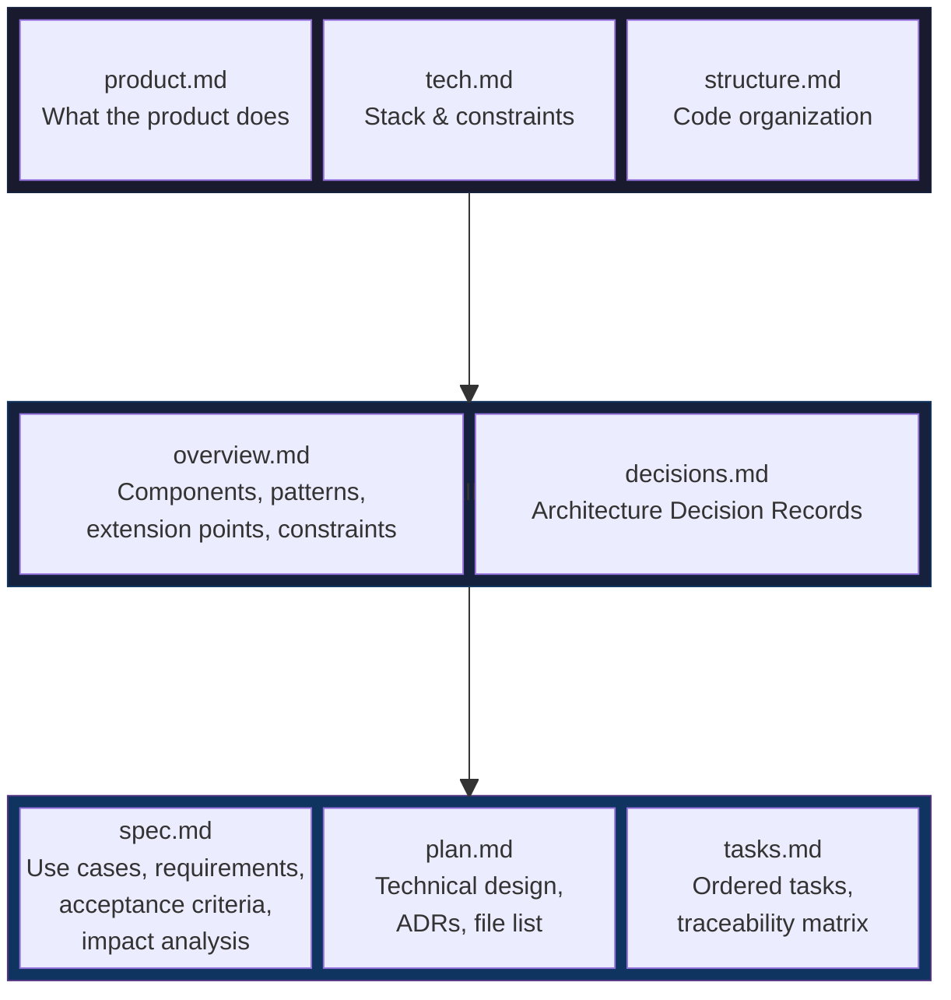
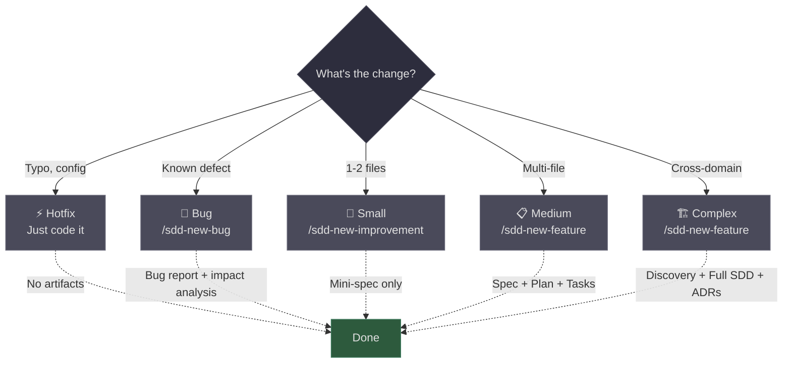

# SDD Starter

A lightweight Spec Driven Development framework for working with AI coding agents. It combines concepts from classical requirements engineering (use cases, acceptance criteria, traceability, impact analysis) with modern spec-driven workflows.

Built for [Claude Code](https://claude.ai/claude-code), tested on real production projects.

## The Problem

AI coding agents don't fail because the model is weak. They fail because instructions are ambiguous and context is missing. Every decision the agent has to guess is a potential point of failure.

The bigger the project, the worse it gets: more domains, more conventions, more things that can break. And when multiple developers work on the same codebase with different agent sessions, knowledge lives in people's heads instead of the repo.

## The Approach

Three layers of documentation that give the agent progressive context:



**System Level** — What the product is, the tech stack, project structure, and a "constitution" of immutable principles that every change must respect.

**Domain Level** — How each domain works: components, patterns, integrations, what's designed to be extended, what must not change, and the technical decisions behind the architecture.

**Feature Level** — Specs with use cases, requirements, acceptance criteria, impact analysis, technical plans, and ordered tasks with full traceability.

Not everything needs the full ceremony. The framework scales from a lightweight bug report to a complete spec-plan-tasks cycle based on actual complexity.

## What's Inside

```
.sdd/
  constitution.md          # Immutable project principles
  config.md                # ID counters (SPC-NNN, BUG-NNN)
  templates/               # Templates for all artifacts
    spec.md                # Use cases + EARS requirements + Gherkin ACs
    plan.md                # Technical design + ADRs + constitution compliance
    tasks.md               # Ordered tasks + traceability matrix
    bug-report.md          # Bug + impact analysis + unchanged behavior
    domain-overview.md     # Components, extension points, constraints
    domain-decisions.md    # Architecture Decision Records per domain
  commands/                # Slash command definitions
    bootstrap.md           # One-time: read codebase, fill everything
    new-feature.md         # Start a new feature spec
    new-bug.md             # Bug report with impact analysis
    new-improvement.md     # Lightweight spec for small changes
    impact-analysis.md     # Standalone blast radius analysis
    advance.md             # Move to next phase
    verify.md              # Validate code against acceptance criteria
    complete.md            # Archive + outcome metrics + domain updates
    health.md              # Aggregate metrics across specs
    update-domain.md       # Refresh domain docs from codebase
docs/
  product.md               # What the product does
  structure.md             # How code is organized
  tech.md                  # Stack and constraints
domains/                   # One folder per domain
specs/
  active/                  # In-progress features
  completed/               # Archived (safety net for impact analysis)
  bugs/                    # Bug reports
CLAUDE.md                  # Entry point for Claude Code
init.sh                    # Installer script
```

## Installation

```bash
# Clone this repo
git clone https://github.com/facuzarate04/sdd-starter.git

# Install into your project
./init.sh /path/to/your/project
```

The script:
- Creates the directory structure
- Copies templates and slash commands
- Appends the SDD section to your existing CLAUDE.md (never overwrites)
- Skips any file that already exists (safe to run multiple times)

## Getting Started

### 1. Bootstrap your project

Open Claude Code in your project and run:

```
/sdd-bootstrap
```

The agent reads your codebase, existing docs, and configuration files, then fills in:
- System docs (product, tech, structure)
- Constitution (extracted from your existing rules and conventions)
- Domain overviews (one per domain detected in your codebase)

Review and approve what it generates.

### 2. Use the right ceremony level



### 3. The full cycle


| Phase | Command | What happens |
|-------|---------|-------------|
| Spec | `/sdd-new-feature` | Agent generates spec, you review |
| Plan | `/sdd-advance` | Agent generates technical plan, you review |
| Tasks | `/sdd-advance` | Agent generates ordered tasks, you review |
| Implement | `/sdd-advance` | Agent implements task by task |
| Verify | `/sdd-verify` | Agent validates code against acceptance criteria |
| Complete | `/sdd-complete` | Archive spec, collect metrics, update domain docs |

### 4. Keeping it updated

```bash
# When the framework gets updates, sync to your project:
./init.sh /path/to/your/project --update
```

This overwrites only templates and commands. Never touches your constitution, domains, specs, or docs.

## Key Concepts

**Constitution** — Immutable principles extracted from your project. Things like "all queries scoped by tenant_id" or "never hard delete". The agent checks compliance before implementing.

**Domain Overviews** — Living documentation of each domain: components, patterns, extension points, constraints (design and legacy), assumptions, and integrations. Updated every time a feature is completed.

**Impact Analysis** — Before any change, the agent reads domain overviews and existing specs to identify what could break. Lists affected domains, at-risk acceptance criteria, and behaviors that must remain intact.

**Traceability** — Every requirement (SPC-NNN.R-NN) traces to acceptance criteria (AC-NN), tasks (T-NN), and back. A traceability matrix in tasks.md ensures nothing is missed.

**Verify** — After implementation, the agent traces each acceptance criterion through the actual code: PASS, FAIL, or PARTIAL. Closes the loop between what was specified and what was built.

**Outcome Metrics** — At completion, you and the agent record: AC hit rate, rework cycles, regressions, ceremony accuracy, and learnings. The `/sdd-health` command aggregates these across specs.

## License

MIT
