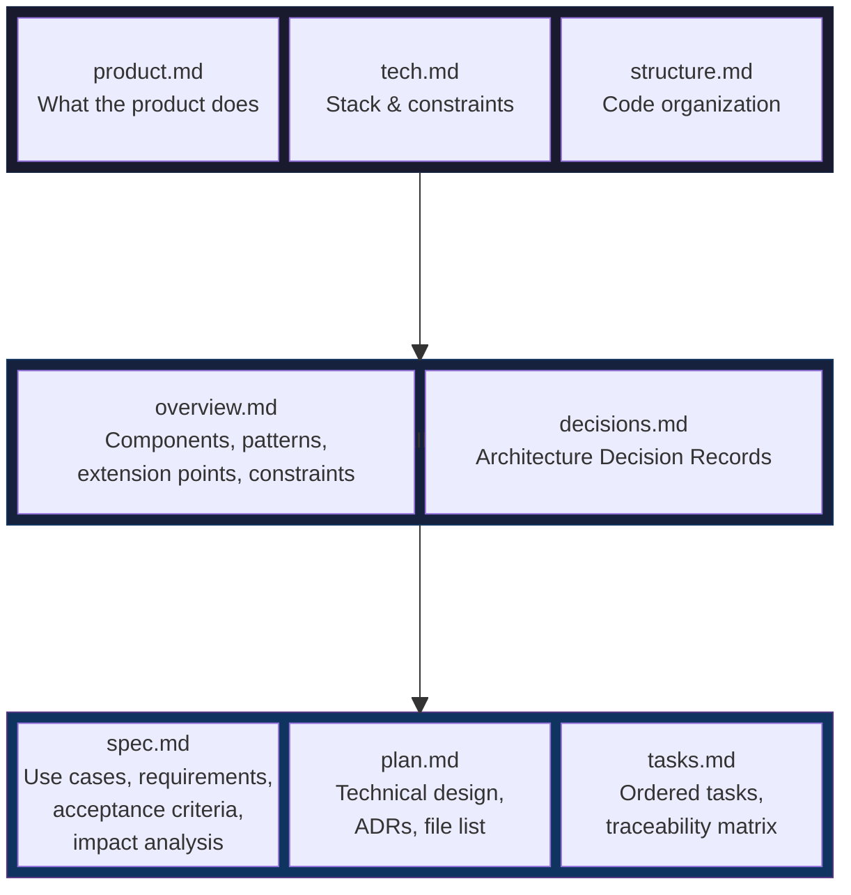
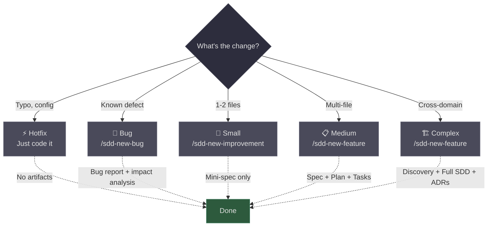

# SDD Starter

A lightweight Spec Driven Development framework for AI coding agents. Combines classical requirements engineering (use cases, acceptance criteria, traceability, impact analysis) with modern spec-driven workflows.

Built for [Claude Code](https://claude.ai/claude-code). Tested on real production projects.

## Three Layers of Context



## Ceremony Scales With Complexity



## The Full Cycle


## Quick Start

```bash
# Clone and install into your project
git clone https://github.com/facuzarate04/sdd-starter.git
./sdd-starter/init.sh /path/to/your/project

# Open Claude Code in your project, then:
/sdd-bootstrap          # One-time: agent reads codebase, fills docs and domains
/sdd-new-feature        # Start a feature spec
/sdd-advance            # Move to next phase (plan → tasks → implement)
/sdd-verify             # Validate code against acceptance criteria
/sdd-complete           # Archive, collect metrics, update domains
```

Safe to run multiple times. Never overwrites existing files. Use `--update` to sync latest templates.

For detailed documentation, see the [full guide](docs/guide.md).

## License

MIT
